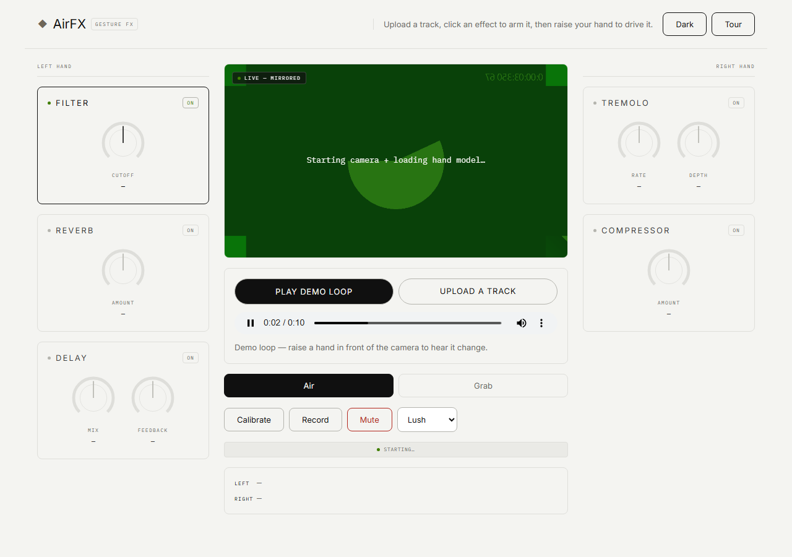

# AirFX

**Hand-gesture audio effects in the browser.** Upload a track, arm an effect, and drive it
by moving your hands in the air in front of your webcam. No install, no build step, no
server — hand tracking and the whole audio graph run locally in the tab.

**▸ [Live demo](https://chimdalu20.github.io/airfx/)** — desktop Chrome or Edge, allow the
camera, headphones recommended. **A demo loop is built in**, so you don't need an audio file.



## What it does

Two modes:

- **Air** — raise or lower each hand to drive the armed effects continuously. Left hand
  controls filter, reverb and delay; right hand controls tremolo and compression.
- **Grab** — a virtual cursor per hand. Pinch to grab a knob, move to turn it, release to let go.

Five effects, each a real Web Audio node: **filter** (cutoff), **reverb** (convolution,
amount), **delay** (mix + feedback), **tremolo** (rate + depth) and **compressor** (amount).
Click a card — or focus it and press Space — to arm or disarm it. Only Filter starts armed, so
the first gesture teaches you one thing rather than five at once. There's a guided first-run tour, a per-hand calibration
step so the range fits your actual reach, three presets, and a recorder that captures the
processed output.

## How it works

| Piece | Approach |
|---|---|
| Hand tracking | MediaPipe Tasks Vision `HandLandmarker`, loaded from CDN via an import map |
| Signal conditioning | Landmarks → normalized height/distance → **One Euro filter** to kill jitter without adding lag |
| Calibration | Aim-based: a ghost hand marks the target, and holding your hand in it captures automatically — no button to press, so nothing drags your hand out of position |
| Audio | A fixed Web Audio graph; gesture values are mapped log or linear per parameter and ramped, never set abruptly |
| Rendering | Plain ES modules, no framework and no bundler |

The interesting problem was **smoothing**. Raw landmark height is noisy enough to make a
filter cutoff audibly chatter, but a simple low-pass adds latency that makes the instrument
feel dead. The One Euro filter (`src/smoothing/one-euro.js`) adapts its cutoff to the speed
of the movement — heavy smoothing when the hand is still, light when it's moving — which is
what makes slow gestures stable and fast ones responsive.

## Design

The interface follows a documented design system — **Hyperstudio**, *"blueprint scratched
into obsidian"* — specified in [`design.md`](design.md): near-black canvas, 1px hairline
rules instead of shadows, weight-400 type, monospace for every number, and exactly one
signal colour reserved for live/armed state.

It ships in **light and dark**, light by default, toggled from the header and remembered per
browser. Both themes are the same semantic tokens with two value sets, and every text colour is
asserted at WCAG AA 4.5:1 against its own canvas rather than judged by eye.

The demo loop is **generated at runtime** (`src/audio/demo-track.js`) — a four-bar progression
rendered through an `OfflineAudioContext` and encoded to WAV in the browser. No audio file ships
with the repo, so there is nothing to license and no binary weight.

## Develop

```bash
npm test          # 39 unit tests, node:test, no dependencies
npm run serve     # http://localhost:8000
npm run test:e2e  # Playwright smoke test
node tests/visual-check.mjs   # screenshots + responsive/overflow assertions (needs `npm i -D playwright`)
```

Unit tests cover the pure layers — smoothing, gesture→value mapping, knob geometry,
landmark normalization and calibration — which is most of the logic that can actually be
wrong.

## Structure

```
src/
  gestures/    camera source, landmark extraction, synthetic source for tests
  smoothing/   one-euro filter, debounce
  mapping/     normalized gesture -> audio parameter
  audio/       Web Audio graph, recorder, impulse response
  calibration/ per-hand reach capture + stored profile
  ui/          control panel, dials, overlay, meters, onboarding, grab cursors
```

## Browser support

Needs `getUserMedia` and Web Audio: desktop Chrome or Edge. Served over HTTPS (camera access
requires a secure context). The layout is responsive down to 375px, though a phone's
front camera makes two-handed gestures impractical in practice.
